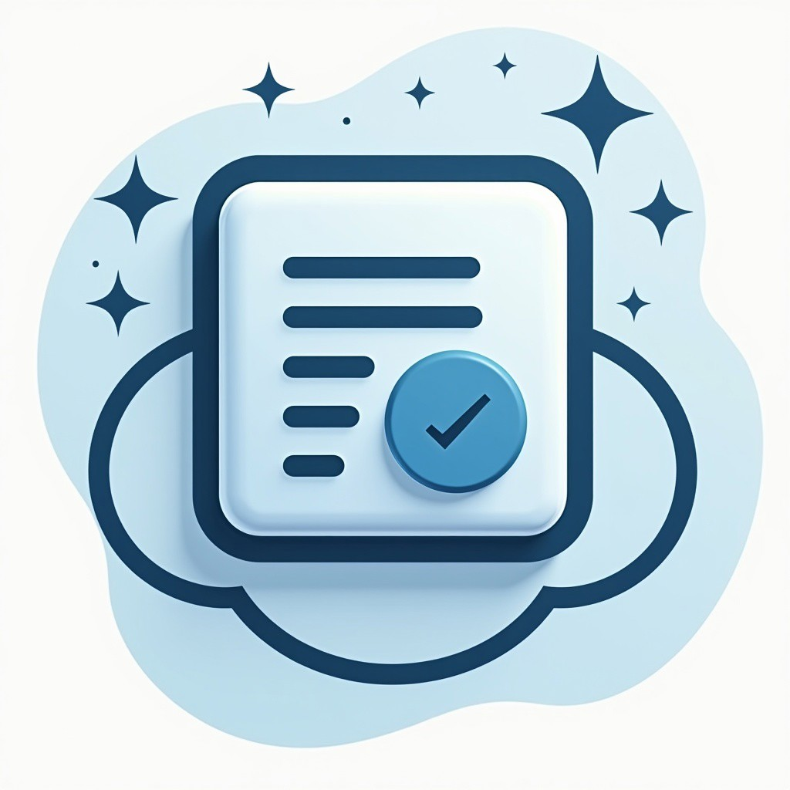

# Obsidian Autopilot Backend



A Python tool for processing and enriching your Obsidian notes, providing automatic summarization, task extraction, and semantic knowledge base features.

## Key Features

- **Note Processing**
  - Generate daily and weekly summaries
  - Extract and structure meeting notes
  - Identify action items and add them to Apple Reminders
  - Extract learnings with auto-generated tags

- **Knowledge Base**
  - Build semantic connections between notes
  - Support for OpenAI or local Ollama embeddings
  - Auto-generate wiki-style links
  - Create backlinks automatically
  - Visualize note connections in graph format

## Installation

### Prerequisites

- Python 3.x
- OpenAI API key (if using OpenAI embeddings)
- Apple Reminders (optional, for task integration)

### Quick Start

1. Clone the repository:
   ```bash
   git clone https://github.com/ivo-toby/gpt-notes-to-tasks.git
   cd gpt-notes-to-tasks
   ```

2. Create and activate virtual environment:
   ```bash
   python -m venv .venv
   source .venv/bin/activate  # On Unix/macOS
   # or
   .venv\Scripts\activate  # On Windows
   ```

3. Install dependencies:
   ```bash
   pip install -r requirements.txt
   ```

4. Set up configuration:
   ```bash
   cp config.template.yaml config.yaml
   # Edit config.yaml with your settings
   ```

## CLI Reference

### Daily Notes Commands

```bash
# Process today's notes
python main.py notes

# Process notes for a specific date
python main.py notes --date 2024-02-16

# Process yesterday's notes
python main.py notes --date yesterday

# Generate weekly summary
python main.py notes --weekly

# Process meeting notes only
python main.py notes --meetingnotes

# Process learnings only
python main.py notes --process-learnings
```

Options:
- `--date`: Specify date (YYYY-MM-DD, "today", or "yesterday")
- `--dry-run`: Preview changes without making modifications
- `--skip-reminders`: Don't create Apple Reminders tasks
- `--replace-summary`: Replace existing summaries instead of updating

### Knowledge Base Commands

```bash
# Initialize knowledge base
python main.py kb --reindex

# Update with recent changes
python main.py kb --update

# Search knowledge base
python main.py kb --query "your search query"

# Search by tag
python main.py kb --find-by-tag "tag-name"

# Search by date
python main.py kb --find-by-date "2024-02-16"

# Analyze single note relationships
python main.py kb --analyze-links "path/to/note.md"

# Show note connections
python main.py kb --show-connections "path/to/note.md"

# Analyze and auto-link all notes
python main.py kb --analyze-all

# Analyze only recently modified notes
python main.py kb --analyze-updated

# View note's semantic structure
python main.py kb --note-structure "path/to/note.md"
```

Options:
- `--limit`: Maximum number of results (default: 5)
- `--dry-run`: Preview changes without modifications
- `--note-type`: Filter by note type (daily, weekly, meeting, learning, note)
- `--graph`: Display connections in graph format (if configured)
- `--auto-link`: Automatically add suggested links without prompting

## Common Commands & Howto

### Daily Note Taking Workflow

1. Start your day by processing yesterday's notes:
   ```bash
   python main.py notes --date yesterday
   ```

2. Throughout the day, take notes in your daily notes file

3. End of day processing:
   ```bash
   # Process today's notes and create summaries
   python main.py notes
   
   # Update knowledge base with new content
   python main.py kb --update
   
   # Analyze new connections
   python main.py kb --analyze-updated --auto-link
   ```

### Weekly Review Process

1. Generate weekly summary:
   ```bash
   python main.py notes --weekly
   ```

2. Process learnings:
   ```bash
   python main.py notes --process-learnings
   ```

3. Update knowledge connections:
   ```bash
   python main.py kb --analyze-all --auto-link
   ```

### Knowledge Base Maintenance

1. Regular updates (daily/after changes):
   ```bash
   python main.py kb --update
   python main.py kb --analyze-updated
   ```

2. Full reindex (monthly or after major changes):
   ```bash
   rm -rf ~/Documents/notes/.vector_store
   python main.py kb --reindex
   python main.py kb --analyze-all --auto-link
   ```

3. Finding Related Content:
   ```bash
   # Search by content
   python main.py kb --query "project planning" --limit 10
   
   # Find notes with specific tag
   python main.py kb --find-by-tag "project" --note-type meeting
   
   # Show connections for a note
   python main.py kb --show-connections "path/to/note.md" --graph
   ```

### Troubleshooting Command

Analyze note structure to understand how it's being processed:
```bash
python main.py kb --note-structure "path/to/note.md"
```

## Configuration

Copy `config.template.yaml` to `config.yaml` and configure your settings:

```yaml
# Essential paths
notes_base_dir: "~/Documents/notes"
daily_notes_file: "~/Documents/notes/daily/daily.md"
daily_output_dir: "~/Documents/notes/daily"
weekly_output_dir: "~/Documents/notes/weekly"
meeting_notes_output_dir: "~/Documents/notes/meetingnotes"
learnings_file: "~/Documents/notes/learnings/learnings.md"
learnings_output_dir: "~/Documents/notes/learnings"

# OpenAI settings (if using OpenAI embeddings)
api_key: "your-api-key"
model: "gpt-4o"

# Embedding configuration (recommended local setup)
embeddings:
  model_type: "ollama"
  model_name: "mxbai-embed-large"
  ollama_config:
    base_url: "http://localhost:11434"
    num_ctx: 512
    num_thread: 4
```

### Vector Store Settings

```yaml
vector_store:
  path: "~/Documents/notes/.vector_store"
  similarity_threshold: 0.60  # For normalized embeddings
  # HNSW index settings - adjust if you get "ef or M is too small" errors
  hnsw_config:
    ef_construction: 800  # Higher = better index quality, slower build (default: 400)
    ef_search: 400      # Higher = more accurate search, slower queries (default: 200)
    m: 256             # Higher = better accuracy, more memory usage (default: 128)
```

If you're processing a large number of notes or getting HNSW errors, try increasing these values.

### Search Thresholds

```yaml
search:
  thresholds:
    default: 0.60
    tag_search: 0.50
    date_search: 0.50
```

## Usage Guide

### Setting Up Your Notes Repository

1. Create basic structure:
   ```bash
   mkdir -p ~/Documents/notes/{daily,weekly,meetingnotes,learnings}
   ```

2. Configure `.gitignore`:
   ```
   .vector_store/
   .obsidian/
   .trash/
   *.excalidraw.md
   .DS_Store
   ```

### Daily Workflow

1. Write notes throughout the day
2. Process daily notes:
   ```bash
   python main.py notes
   ```
3. Update knowledge base:
   ```bash
   python main.py kb --update
   ```

### Weekly Workflow

1. Generate weekly summary:
   ```bash
   python main.py notes --weekly
   ```

2. Review and process learnings:
   ```bash
   python main.py notes --process-learnings
   ```

## Technical Details

### Embedding Model Comparison

Two primary options are available:

1. **OpenAI (text-embedding-3-small)**
   - Normalized embeddings (0-1 range)
   - Typical scores: 0.35-0.45
   - Requires API key and internet connection

2. **Ollama (mxbai-embed-large)**
   - Local processing
   - Better handling of technical content
   - Typical scores: 0.60-0.65
   - Recommended for code snippets and documentation

### Maintenance

1. Monthly vector store optimization:
   ```bash
   rm -rf ~/Documents/notes/.vector_store
   python main.py kb --reindex
   ```

2. Monitor similarity scores:
   - OpenAI: Use thresholds 0.60-0.85
   - Ollama: Use thresholds 0.50-0.70

### Troubleshooting

1. Enable debug logging:
   ```yaml
   # In config.yaml
   logging:
     level: "DEBUG"
   ```

2. Common fixes:
   ```bash
   # Clear vector store
   rm -rf ~/Documents/notes/.vector_store
   
   # Rebuild index
   python main.py kb --reindex
   
   # Check Ollama service
   curl http://localhost:11434/api/embeddings
   ```

## Acknowledgments

This tool was created using:
- CodeLLama
- GPT-4o
- Claude 3.5 Sonnet
- Gemini 2 Flash
- Anthropic MCP
- Cursor
- aider.chat
